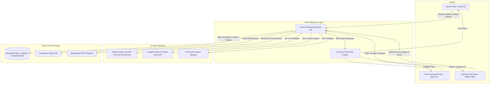

# PawConnect India (PawRescue) 🐾

<p align="center">
  
</p>

<p align="center">
  <strong>India’s Next-Gen AI-Powered Stray Animal Rescue Dispatch, Canine Registry & Municipal Geospatial Intelligence Grid</strong>
</p>

<p align="center">
  <a href="https://client-jet-pi.vercel.app/"></a>
  <a href="https://pawrescue-ai-service.onrender.com/"></a>
  <a href="https://pawrescue-nine.vercel.app/"></a>
  
  
  
</p>

---

## 📖 Table of Contents
- [🌟 Overview & Mission](#-overview--mission)
- [✨ Key Features](#-key-features)
  - [1. Multi-Tier AI Vision & Animal Validation Engine](#1-multi-tier-ai-vision--animal-validation-engine)
  - [2. 30-Second Citizen Emergency Rescue Portal](#2-30-second-citizen-emergency-rescue-portal)
  - [3. NGO Command Center & Geospatial Dispatch](#3-ngo-command-center--geospatial-dispatch)
  - [4. Centralized National Stray Animal Registry](#4-centralized-national-stray-animal-registry)
  - [5. Volunteer Mobile Fleet Management](#5-volunteer-mobile-fleet-management)
  - [6. Municipal Heatmap & Analytics](#6-municipal-heatmap--analytics)
- [🏗️ System Architecture](#️-system-architecture)
- [🛠️ Tech Stack](#️-tech-stack)
- [📂 Project Directory Structure](#-project-directory-structure)
- [🚀 Getting Started Locally](#-getting-started-locally)
- [⚙️ Environment Variables](#️-environment-variables)
- [📡 API Documentation](#-api-documentation)
- [🌐 Deployment Architecture](#-deployment-architecture)
- [🤝 Contributing & License](#-contributing--license)

---

## 🌟 Overview & Mission

India faces over **2.76 Million annual stray dog bite incidents** and holds the world’s largest community dog population. Over 40% of injured street animals never receive timely medical aid due to fragmented reporting channels, lack of triage infrastructure, and zero longitudinal traceability for Anti-Rabies Vaccinations (ARV) and Animal Birth Control (ABC) surgeries.

**PawConnect India** bridges the critical gap between compassionate citizens, animal welfare NGOs, municipal corporations, and emergency veterinarians through:
1. ⚡ **30-Second Emergency Incident Reporting** with automatic GPS reverse-geocoding.
2. 🤖 **Real-Time Edge/Cloud AI Animal Vision Validation** powered by YOLOv8 & Google Gemini Vision.
3. 🗺️ **Proximity-Based Geospatial Dispatch Map** (`2dsphere` MongoDB indexing) routing ambulance missions within a 5–50 KM radius.
4. 🐕 **Digital Health Passports & Biometric Re-Identification** for community dogs.
5. 📊 **Municipal Surveillance Grid** tracking dog density, bite hotspots, and vaccination coverage across 710+ Indian districts.

---

## ✨ Key Features

### 1. Multi-Tier AI Vision & Animal Validation Engine
The platform incorporates an intelligent 3-tier visual analysis pipeline to prevent fake, spoofed, or non-animal uploads while accurately detecting stray animals:
- **Tier 1 (FastAPI YOLOv8 Microservice)**: Ultralytics YOLOv8n object detector identifying COCO classes with custom confidence thresholding (`dog: 16`, `cat: 15`, `cow: 19`).
- **Tier 2 (Google Gemini 1.5 Flash Vision API)**: Serverless multimodal fallback that extracts breed predictions, coat patterns, visual symptoms, and age group classifications.
- **Tier 3 (In-Process Neural & Visual Feature Analyzer)**: Fallback engine examining ocular chromatic ratios, ginger/canine pigmentation, and strict skin-tone exclusion.
- **Strict Anti-Spoofing**: Human faces, selfies, portraits, vehicles, and inanimate objects are instantly rejected with feedback guidance.

### 2. 30-Second Citizen Emergency Rescue Portal
- **One-Tap GPS Auto-Pinning**: Browser geolocation with reverse-geocoded road, landmark, and district names.
- **Photo Capture & Auto-Compression**: Live camera capture or device gallery upload with client-side canvas optimization to prevent large payload bottlenecks.
- **Live Tracking System (`PC-2026-XXXX`)**: Real-time 4-stage visual progress stepper (`Reported` ➔ `Assigned` ➔ `In Treatment` ➔ `Resolved`) with assigned ambulance and volunteer contact details.
- **Citizen Dashboard**: Personal rescue logs, status filters, and community contribution badges.

### 3. NGO Command Center & Geospatial Dispatch
- **Live Triage Queue**: Real-time KPI counters (Total, Critical Emergencies, Active Rescues, Resolved Today).
- **Interactive Dispatch Map**: Leaflet / OpenStreetMap visual grid showing accident coordinates, shelter HQ radii (5 KM, 10 KM, 20 KM, 50 KM), and automated route polylines.
- **Case Inspection Modal**: High-res photo zoom, medical history notes timeline, symptom tags, and direct volunteer assignment.

### 4. Centralized National Stray Animal Registry
- **Digital Health Passport**: Unique Stray Dog IDs (e.g. `DOG-0023` *Sheru*).
- **Vaccination Records**: Anti-Rabies (ARV) and 7-in-1 vaccination schedules with auto-expiring renewal warnings.
- **Sterilization Verification**: ABC surgery tracking, ear-notch side verification (Left/Right Ear), and supervising surgeon details.
- **Community Sighting Logger**: "I Saw This Dog Today" community sighting logs monitoring dog pack territory dynamics.

### 5. Volunteer Mobile Fleet Management
- **Roster & Live Availability**: Real-time duty toggles (`Available`, `On Mission`, `Off Duty`).
- **Mission Dispatch Alerts**: Instant Push/Socket notifications with incident distance, GPS turn-by-turn routing, and citizen contact info.
- **Photo Proof of Resolution**: Field volunteers upload post-treatment recovery photos before marking cases resolved.

### 6. Municipal Heatmap & Analytics
- **7-Layer Geospatial Grid**: District-level dog population census data, dog bite risk formula $[(\text{Aggressive} \times 5) + (\text{Bites} \times 10) + (\text{Rabies} \times 20)]$, and municipal vaccination coverage bands (🟢 >80%, 🟡 50-80%, 🔴 <50%).
- **Interactive Analytics**: Monthly resolution trends, category distributions, and regional emergency hotspot charts.

---

## 🏗️ System Architecture



---

## 🛠️ Tech Stack

### Frontend
- **Framework**: [React 19](https://react.dev/) + [TypeScript](https://www.typescriptlang.org/)
- **Build Tool**: [Vite](https://vitejs.dev/)
- **Styling**: [Tailwind CSS](https://tailwindcss.com/)
- **Maps**: [Leaflet](https://leafletjs.com/) + [React-Leaflet](https://react-leaflet.js.org/)
- **Icons**: [Lucide React](https://lucide.dev/) + [Google Material Symbols](https://fonts.google.com/icons)
- **Networking & Sockets**: [Axios](https://axios-http.com/) + [Socket.io-Client](https://socket.io/)

### Backend & API
- **Runtime**: [Node.js](https://nodejs.org/) + [Express.js](https://expressjs.com/) (TypeScript)
- **Database**: [MongoDB Atlas](https://www.mongodb.com/atlas) with Mongoose (`2dsphere` spatial indexing)
- **Authentication**: JWT (JSON Web Tokens) with bcrypt password hashing
- **Media CDN**: [Cloudinary SDK](https://cloudinary.com/) (multipart/form-data with Multer)
- **Notifications**: [Nodemailer](https://nodemailer.com/) + Socket.IO

### AI & Computer Vision Microservice
- **Framework**: [FastAPI](https://fastapi.tiangolo.com/) (Python 3.11) + [Uvicorn](https://www.uvicorn.org/)
- **Object Detection**: [Ultralytics YOLOv8](https://github.com/ultralytics/ultralytics) (`yolov8n.pt`)
- **Computer Vision**: [PyTorch](https://pytorch.org/), [Torchvision](https://pytorch.org/vision/stable/index.html), [OpenCV Headless](https://pypi.org/project/opencv-python-headless/), [Pillow](https://python-pillow.org/)
- **Multimodal LLM**: [Google Gemini 1.5 Flash Vision](https://ai.google.dev/)

---

## 📂 Project Directory Structure

```plaintext
pawrescue/
├── ai-service/              # Python FastAPI YOLOv8 AI Microservice (Hosted on Render)
│   ├── main.py              # YOLOv8 object detection & animal validation endpoints
│   ├── requirements.txt     # Python dependencies (torch, ultralytics, opencv, etc.)
│   └── yolov8n.pt           # COCO pretrained weights
│
├── client/                  # Citizen & Public Portal (React 19 + Vite)
│   ├── src/
│   │   ├── api/             # Axios API client & endpoints
│   │   ├── components/      # UI components (Citizen, NGO, Volunteer, Maps, AI Review)
│   │   ├── utils/           # Canvas compressor, animal validator, geolocation
│   │   └── App.tsx          # Main React router & layout
│   └── package.json
│
├── ngo-client/              # Dedicated NGO Command Suite (React 19 + Vite)
│   ├── src/                 # Triage table, ambulance dispatch map, volunteer roster
│   └── package.json
│
├── server/                  # Core Backend REST API (Node.js + Express + TypeScript)
│   ├── src/
│   │   ├── config/          # Database connection, Cloudinary, Nodemailer
│   │   ├── models/          # Mongoose Schemas (Complaint, NGO, DogProfile, Volunteer)
│   │   ├── routes/          # REST endpoints (auth, complaints, dogs, analytics, ngos)
│   │   ├── services/        # AI Animal Validation, Routing Engine, Dog Profiler
│   │   ├── sockets/         # Socket.IO real-time event handlers
│   │   └── server.ts        # Express app configuration & server initialization
│   └── package.json
│
├── api/                     # Vercel Serverless entrypoint
│   └── index.ts
│
├── vercel.json              # Vercel deployment routing configuration
└── README.md
```

---

## 🚀 Getting Started Locally

### Prerequisites
- **Node.js**: `v18.0.0` or higher
- **Python**: `v3.10` or `v3.11` (Optional, only if running local YOLO microservice)
- **MongoDB**: Local MongoDB instance or MongoDB Atlas Connection String
- **Git**

---

### Step 1: Clone the Repository
```bash
git clone https://github.com/ashish-tiwari-12/pawrescue.git
cd pawrescue
```

### Step 2: Configure Environment Variables
Create a `.env` file in the `server/` directory (see [Environment Variables](#️-environment-variables) below).

```bash
cp server/.env.example server/.env
```

### Step 3: Install Dependencies
```bash
# Install root & server dependencies
cd server
npm install

# Install client dependencies
cd ../client
npm install

# (Optional) Install Python AI microservice dependencies
cd ../ai-service
pip install -r requirements.txt
```

### Step 4: Run the Application Locally

**Terminal 1 (Backend Server):**
```bash
cd server
npm run dev
# Server running at http://localhost:5000
```

**Terminal 2 (Frontend Client):**
```bash
cd client
npm run dev
# Frontend running at http://localhost:3000 or http://localhost:5173
```

**Terminal 3 (Optional - Python YOLOv8 AI Service):**
```bash
cd ai-service
uvicorn main:app --host 0.0.0.0 --port 8000 --reload
# AI Service running at http://localhost:8000
```

---

## ⚙️ Environment Variables

### `server/.env`
```env
# Server Configuration
PORT=5000
NODE_ENV=development

# Database (MongoDB Atlas)
MONGODB_URI=mongodb+srv://<username>:<password>@cluster0.xxx.mongodb.net/pawrescue?retryWrites=true&w=majority

# JWT Authentication
JWT_SECRET=your_super_secret_jwt_key_here

# Nodemailer Email Configuration
EMAIL_USER=your_email@gmail.com
EMAIL_PASS=your_gmail_app_password

# Cloudinary Storage Configuration (for Photos)
CLOUDINARY_CLOUD_NAME=your_cloudinary_cloud_name
CLOUDINARY_API_KEY=your_cloudinary_api_key
CLOUDINARY_API_SECRET=your_cloudinary_api_secret

# AI Vision Service Configuration
# AI_SERVICE_URL=https://pawrescue-ai-service.onrender.com   # Live Render YOLO Microservice
# GEMINI_API_KEY=AIzaSy...                                   # Google Gemini Vision API Key (Optional)
```

---

## 📡 API Documentation

### 🚨 Complaints & Emergency Rescue
| Method | Endpoint | Description | Auth |
| :--- | :--- | :--- | :--- |
| `POST` | `/api/complaints` | Submit a new stray animal rescue report | Optional |
| `GET` | `/api/complaints` | List complaints with filters (status, category, priority) | NGO / Admin |
| `GET` | `/api/complaints/:id` | Get complaint details and audit timeline | Public / Citizen |
| `GET` | `/api/complaints/track/:trackingCode` | Track incident status by Tracking ID (e.g. `PC-2026-1234`) | Public |
| `PATCH` | `/api/complaints/:id/status` | Update incident status and append clinical notes | NGO / Volunteer |
| `POST` | `/api/complaints/:id/assign` | Assign incident to a volunteer or ambulance | NGO Admin |

### 🤖 AI Animal Vision & Detection
| Method | Endpoint | Description |
| :--- | :--- | :--- |
| `POST` | `/api/dogs/validate-animal` | Real-time validation: verifies Dog, Cat, or Cow with confidence score |
| `POST` | `/api/dogs/analyze-image` | Deep feature analysis extracting breed, coat color, and age group |
| `GET` | `/api/debug/animal-detection` | Live health & diagnostic check for active AI detection tier |

### 🐕 Stray Dog Digital Registry
| Method | Endpoint | Description |
| :--- | :--- | :--- |
| `GET` | `/api/dogs` | List registered community dogs with vaccination & ABC status |
| `POST` | `/api/dogs` | Register a new community dog with photos & medical history |
| `POST` | `/api/dogs/match` | Match uploaded sighting against registry using visual embeddings |
| `POST` | `/api/dogs/:id/sightings` | Log a community sighting ("I Saw This Dog Today") |

### 🏥 NGOs & Volunteers
| Method | Endpoint | Description |
| :--- | :--- | :--- |
| `GET` | `/api/ngos` | List verified animal welfare NGOs and shelter HQs |
| `GET` | `/api/volunteers` | Get volunteer roster with live availability status |
| `PATCH` | `/api/volunteers/:id/status` | Toggle volunteer status (`Available`, `On Mission`, `Off Duty`) |

---

## 🌐 Deployment Architecture

| Component | Platform | URL |
| :--- | :--- | :--- |
| **Citizen & Public App** | **Vercel** | [https://client-jet-pi.vercel.app/](https://client-jet-pi.vercel.app/) |
| **Backend REST API** | **Vercel Serverless** | [https://pawrescue-nine.vercel.app/](https://pawrescue-nine.vercel.app/) |
| **AI YOLOv8 Microservice** | **Render** | [https://pawrescue-ai-service.onrender.com/](https://pawrescue-ai-service.onrender.com/) |
| **Database** | **MongoDB Atlas** | AWS Mumbai Region (`ap-south-1`) |
| **Media Assets** | **Cloudinary CDN** | Global Multi-Region CDN |

---

## 🤝 Contributing & License

Contributions, feature requests, and community feedback are welcome!
Feel free to open an [Issue](https://github.com/ashish-tiwari-12/pawrescue/issues) or submit a [Pull Request](https://github.com/ashish-tiwari-12/pawrescue/pulls).

Distributed under the **MIT License**. See `LICENSE` for more information.

<p align="center">
  Made with ❤️ for the Welfare of Stray Animals across India 🇮🇳 🐾
</p>
